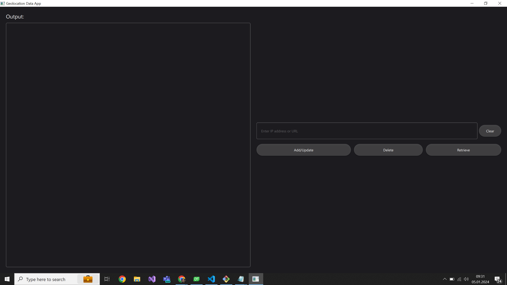
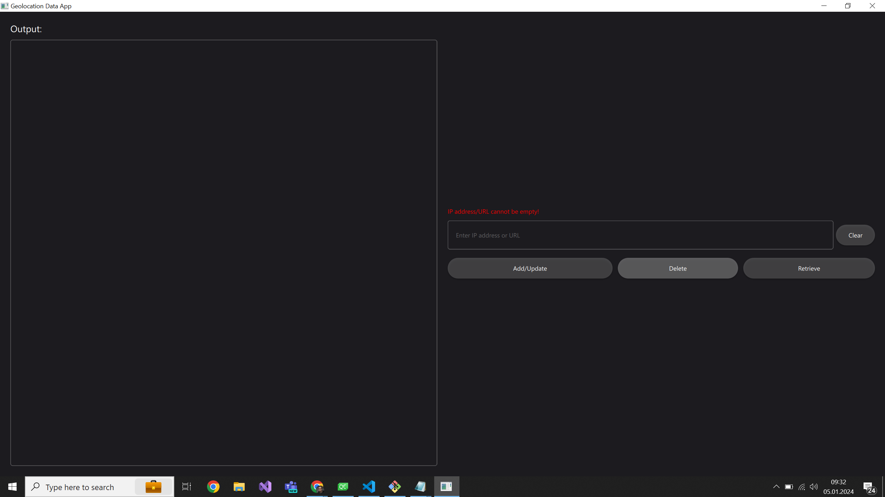
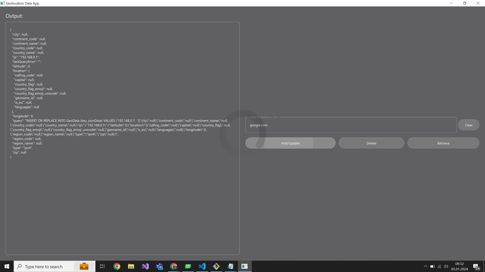
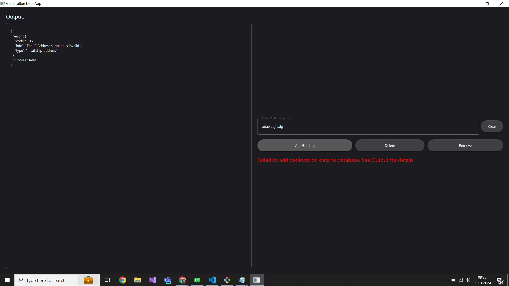
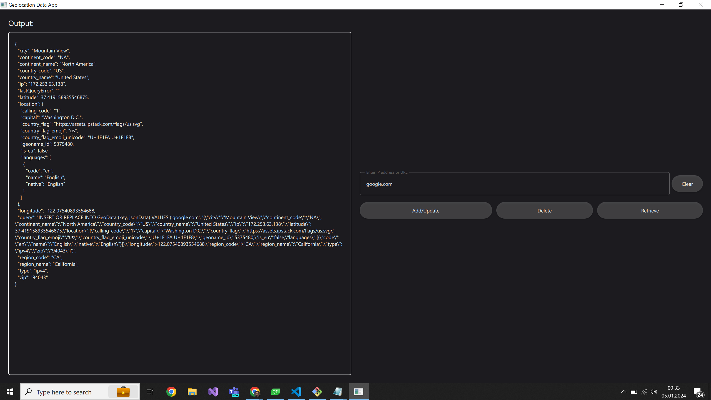
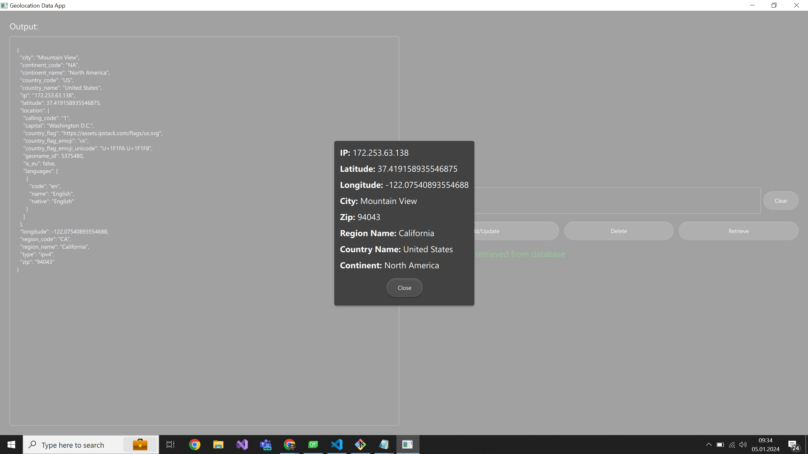

<h1>Geolocation Desktop Application</h1>
This is a desktop application built using Qt framework for storing and retrieving geolocation data based on IP address or URL. The application utilizes the ipstack API for geolocation data retrieval. It allows users to add, delete, or query geolocation information by entering either an IP address or a URL.
Getting Started

These instructions will help you set up and run the application on your local machine for testing purposes.

<b>Prerequisites:</b>
Before you begin, ensure you have the following dependencies installed:
CMake: This project requires CMake version 3.16 or higher.
Qt Framework: You need to have Qt 6.4 installed with specific components: Quick, Sql, and Network.
C++ Compiler (e.g., GCC or Visual Studio C++): Make sure you have a C++ compiler installed.

<b>Launch the application using Qt Creator:</b>
Open Qt Creator.
Open the project by selecting the CMakeLists.txt file in the project root directory.
Build and run the project from within Qt Creator.

<b>Usage:</b>
Once the application is up and running, you can interact with it to perform the following actions:
- Add Geolocation Data: Enter an IP address or URL to retrieve and store geolocation data in the database.
- Delete Geolocation Data: Remove geolocation data based on a specific IP address or URL.
- Query Geolocation Data: Retrieve geolocation data by entering an IP address or URL.

<b>Screenshots:</b>

